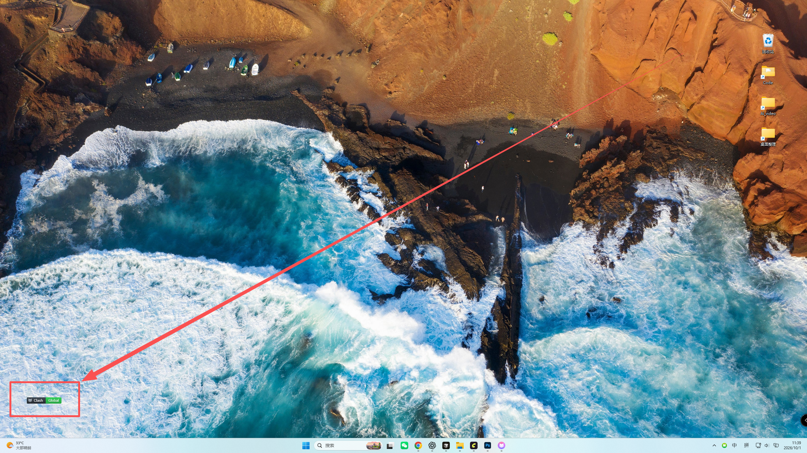

# ClashBadge

一个用于 **Clash Verge Rev** 的 Rainmeter 桌面模式徽章。显示实际代理模式，支持在全局与直连之间切换。



## 功能

- 20 / 28 像素两种可点击尺寸，另保留原始 20 像素仅显示版。
- 左侧深灰区域拖动位置，右侧模式色块点击切换。
- Global 绿色、Direct 灰色、Rule 蓝色；连接失败时显示 Offline。
- 通过 Clash Verge 自身的模式动作切换，并确认核心模式与保存的配置同步。
- 长按、移动和移出色块取消点击；切换期间防止重复触发。

## 安装与配置

验证环境：Windows，Rainmeter **4.5.26.3894（64 位）**，Clash Verge Rev **2.5.6**。

1. 下载本项目 ZIP 并解压，将整个 `ClashMode` 文件夹放入 Rainmeter 的 `Skins` 目录。
   一般为“文档\Rainmeter\Skins”；OneDrive 或自定义目录以实际设置为准。
2. 启动 Clash Verge Rev，在设置中启用外部控制器，监听地址设为 `127.0.0.1:9097`。
3. 本公开版本使用示例密钥 `change-me`。推荐设置自己的密钥，然后同时修改：
   - `ClashMode/Badge.inc` 中 `Header=Authorization: Bearer change-me`。
   - `ClashMode/@Resources/ClashBadgeControl.cs` 中的 `Bearer change-me`。
   修改源码后，双击根目录的 `重新编译.cmd`，生成与设置匹配的控制程序。
4. 在 Clash Verge 中启用全局快捷键，设置 **全局模式 Alt+1**、**直连模式 Alt+2**。
   确认快捷键已注册成功，没有被其他程序占用。
5. 建议启用 Clash Verge 的“切换模式时自动关闭连接”，让已有连接随模式切换重新建立。
6. Rainmeter 管理器点击“刷新全部”，加载 `ClashMode20.ini` 或 `ClashMode28.ini`。
7. 皮肤右键菜单中启用“允许拖动”，取消“点击穿透”。

可执行程序已经附带，使用示例密钥时可以直接运行。编译脚本使用 Windows 的 .NET Framework C# 编译器。首次使用前需要正常配置 Clash 的订阅、节点和系统代理或 TUN。

## 操作

**左侧猫图标和 Clash 文字**：按住左键拖动，无需 Ctrl。

**右侧模式色块**：左键短按，在 Global 与 Direct 之间切换。当前为 Rule 时，第一次点击转为 Direct。

切换尚未完成时，连续点击会被忽略。长按、移动超过容差或离开色块会取消本次点击。

在 Clash 界面修改模式后，徽章会定期读取并同步显示。`ClashMode.ini` 是原始仅显示版，不支持点击切换。

## 文件与源码

```text
ClashMode/
  ClashMode.ini                    原始 20px 仅显示版
  ClashMode20.ini                  20px 可点击版
  ClashMode28.ini                  28px 可点击版
  Badge.inc                        共用外观和模式读取
  @Resources/
    Click.lua                      点击处理和切换保护
    ClashBadgeControl.exe          模式控制程序
    ClashBadgeControl.cs           C# 源码
    mark.png                       猫图标
使用说明.txt                        详细安装和使用说明
重新编译.cmd                        本地编译脚本
```

`ClashBadgeControl.exe` 由附带的 C# 源码编译生成。Rainmeter 在接受点击后启动它，调用 Clash Verge 注册的模式动作，检查切换结果，然后退出，无需手动打开。

如需更换控制器端口，也要同时修改 `Badge.inc` 和 `ClashBadgeControl.cs` 的请求地址，重新编译并刷新皮肤。

## 排查问题

- **Offline**：检查 Clash 进程、控制器开关、地址和密钥。
- **点击不切换**：确认加载可点击版本、点击右侧色块，并检查全局快捷键和 Alt+1 / Alt+2 设置。
- **无法拖动**：从左侧开始拖动，检查皮肤及 Rainmeter 全局拖动设置。
- **鼠标无响应**：取消“点击穿透”。
- **模式改变但旧连接仍保留**：开启切换时自动关闭连接，重新打开网页验证。
- 其他错误可在 Rainmeter 管理器的“查看日志”中查看。

此版本针对 Clash Verge Rev 的快捷键内部实现。其他 Clash 客户端不适用；升级 Clash Verge 后需要重新验证。

## 相关项目

- [Rainmeter](https://www.rainmeter.net/)
- [Clash Verge Rev](https://github.com/clash-verge-rev/clash-verge-rev)

ClashBadge 是独立的第三方皮肤。本仓库不包含个人订阅、节点或用户配置文件。
